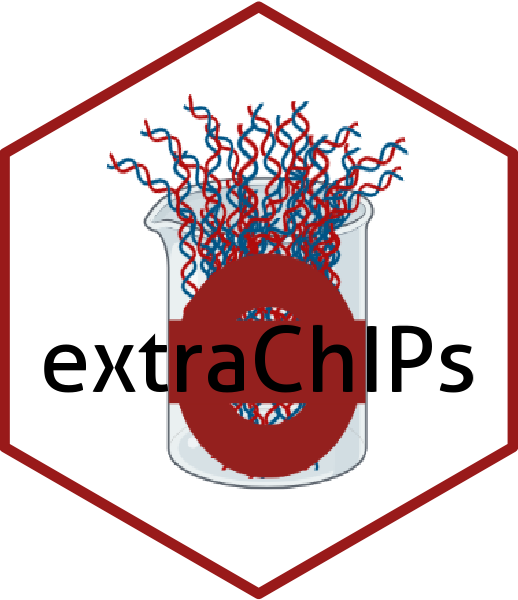

# extraChIPs 

<!-- badges: start -->
[](https://github.com/smped/extraChIPs/actions)
[](https://codecov.io/gh/smped/extraChIPs?branch=main)
[](https://shields.io/)
[](https://zenodo.org/badge/latestdoi/399671214)
<!-- badges: end -->

`extraChIPs` is a package primarily designed to enable ChIP-Seq analysis.
Whilst the package was primarily built for the 
[GRAVI: Gene Regulatory Analysis using Variable Inputs](https://github.com/smped/GRAVI)  
workflow, the functionality extends beyond this specific application.
Functions focus primarily on

- Retaining `mcols()` when manipulating `GRanges` objects
- Common visualisation utilities for ChIP-Seq analysis
- Enabling sliding window analysis for differential ChIP-target binding

It is intended that these functions will integrate seamlessly with other 
packages such as those provided in `csaw`, `plyranges` and `limma`.

In addition to enabling workflows, simple coercion to `tibble` objects from 
`DataFrame`, `GRanges` and `GInteractions` objects is implemented.

## Installation Instructions

To install this package from Bioconductor, please use `BiocManager`.

```r
install.packages("BiocManager")
BiocManager::install("extraChIPs")
```

To install the development version from github


```r
BiocManager::install("smped/extraChIPs")
```
