# Introduction

The [GRAVI](https://github.com/smped/GRAVI) workflow, for which this
package is designed, uses sliding windows for differential signal
analysis using strategies defined in the package `csaw` (Lun and Smyth
2016). The GRAVI workflow itself extends to integrating multiple ChIP
targets and external data sources, and as such, this package introduces
a handful of functions to simplify and enable these analyses. Whilst
many existing approaches refer to this type of analysis as Differential
Binding analysis, we prefer the term *Differential Signal Analysis* as
this more accurately captures the range of ChIP targets which are likely
to be investigated, such as H3K27ac or similar.

The majority of examples below use heavily reduced datasets to provide
general guidance on using the functions. Some results may appear trivial
as a result, but will hopefully prove far more useful in a true
experimental context. All data, along with this vignette are available
[here](https://github.com/smped/extraChIPs_vignette). In order to
replicate this vignette, please place all contents of the `data`
directory provided in this additional repository into a directory named
data in your own working directory.

It may also be worth noting that this vignette should run on a
conventional laptop with no particularly large performance requirements.
However, when following this workflow across an entire genome, memory
requirements may exceed those of a standard laptop, and an HPC or
high-performance workstation may be required.

# Setup

## Installation

In order to use the package `extraChIPs` and follow this vignette, we
recommend using the package `BiocManager` (hosted on CRAN) to install
all packages. Once `BiocManager` is installed, the additional packages
required for this vignette can also be installed as shown below.

``` r
if (!"BiocManager" %in% rownames(installed.packages()))
  install.packages("BiocManager")
pkg <- c(
  "tidyverse", "Rsamtools", "csaw", "BiocParallel", "rtracklayer", "edgeR", 
  "patchwork", "extraChIPs", "plyranges", "scales", "glue", "here", "quantro",
  "cqn", "ggrepel", "BSgenome.Hsapiens.UCSC.hg19"
)
BiocManager::install(pkg, update = FALSE)
```

Once these packages are installed, we can load them easily

``` r
library(tidyverse)
library(Rsamtools)
library(csaw)
library(BiocParallel)
library(rtracklayer)
library(edgeR)
library(patchwork)
library(extraChIPs)
library(plyranges)
library(scales)
library(glue)
library(here)
library(magrittr)
library(quantro)
library(cqn)
library(ggrepel)
library(BSgenome.Hsapiens.UCSC.hg19)
theme_set(theme_bw())
```

## Data

All data for this vignette is expected to be in a sub-directory of the
working directory named “data” (including “data/H3K27ac”), and all paths
will be predicated on this. Please ensure you have all data in this
location, obtained from
[here](https://github.com/smped/extraChIPs_vignette).

The data itself is ChIP-Seq data targeting the histone mark H3K27ac, and
is taken from the ZR-75-1 cell-line using data from the BioProject ,
Preprocessing was performed using the
[`prepareChIPs`](https://github.com/smped/prepareChIPs) workflow,
written in snakemake (Mölder et al. 2021) and all code is available at
<https://github.com/smped/PRJNA509779>. H3K27ac signal was obtained
under baseline (E2) and DHT-treated (E2DHT) conditions, with alignments
being to GRCh37. For this workflow, data has been subset to a region
found on chromosome 10 for simplicity.

A description of the samples can be found in the file
`data/PRJNA509779.tsv`. A pooled Input (IgG) sample was used for the
entire dataset and this accession is provided in a separate column.

``` r
samples <- here("data", "PRJNA509779.tsv") %>% 
  read_tsv() %>% 
  dplyr::filter(target == "H3K27ac") %>% 
  mutate(treatment = factor(treatment, levels = c("E2", "E2DHT")))
accessions <- unique(c(samples$accession, samples$input))
treat_colours <- c("steelblue", "red3", "grey")
names(treat_colours) <- c(levels(samples$treatment), "Input")
```

# Differential Signal Analysis

## Sliding Windows

The standard approach of tools such as DiffBind (Ross-Innes et al. 2012)
is to take a set of peaks, re-centre them, then set all regions to be
the same width. From there, data is passed to `edgeR` (Chen, Lun, and
Smyth 2016) or `DESeq2` (Love, Huber, and Anders 2014) for analysis.
This approach using `extraChIPs` is demonstrated in a separate vignette,
however, this workflow instead focusses on a sliding window approach as
per the package `csaw` (Lun and Smyth 2016). The resultant *variable
width regions* can be particularly advantageous for ChIP targets such as
H3K27ac where regions marked by histone-acetylation can vary greatly in
size.

The starting point for differential signal analyses using `extraChIPs`
is to define a set of sliding windows across the genome, then count
reads from a set of bam files, defined as a `BamFileList.` Commonly one
or more IP input/control samples is also produced during a ChIP-Seq
experiment, and these should be included at this stage of the analysis.
The example files provided here contain a small subset of reads from
chromosome 10 across two experimental conditions and one input sample,
and we will define them all as a `BamFileList`.

``` r
bfl <- here("data", "H3K27ac", glue("{accessions}.bam")) %>% 
  BamFileList() %>% 
  setNames(str_remove_all(names(.), ".bam"))
file.exists(path(bfl))
```

    ## [1] TRUE TRUE TRUE TRUE TRUE TRUE TRUE

``` r
sq <- seqinfo(bfl)
isCircular(sq) <- rep(FALSE, length(seqlevels(sq)))
genome(sq) <- "GRCh37"
```

**NB:** It should also be noted that counting all reads across a
`BamFileList` using sliding windows, **will require a significant amount
of RAM** and will be beyond the capacity of most laptops as of the time
of writing. When working with complete datasets, this particular step is
best performed on an HPC or a similar interactive server with a large
amount of memory.

The approach taken below is to first define a set of sliding windows
across the genome, using the capabilities of `csaw`. After counting
reads across all windows, a set of *pre-defined regions* where H3K27ac
signal is confidently found, is then used guide the function
`dualFilter()`. This function will discard low-signal windows, retaining
only those a) above a minimum signal level and b) with signal notably
above that of any input samples. These regions can be obtained from any
external resource, or can even be taken from `macs2`-defined peaks from
the same samples. Here, the set of regions was defined as those found
when merging samples from each treatment, in both treatments, with an
FDR \< 0.01. Importantly, our analysis will not be restricted to these
regions, but these will instead guide `dualFilter()` as to the best
regions to retain for analysis.

First we can define our windows and count the alignments using the
existing capabilities and functions provided in the `csaw` package. In
the following, we’ll use a sliding window of 120bp and a step size of
40bp, meaning each nucleotide is covered by 3 windows. In addition,
we’ll exclude blacklisted and grey-listed regions as provided in the
dataset. These can be obtained easily by using the `GreyListChIP`
package, which is beyond the scope of this vignette, however, code for
preparing the GreyList\` is available
[here](https://github.com/smped/PRJNA509779/blob/main/workflow/scripts/make_greylist.R).
Fragment sizes for each sample were also estimated to be around 200nt.

``` r
greylist <- here("data", "chr10_greylist.bed") %>% 
  import.bed(seqinfo = sq)
blacklist <- here("data", "chr10_blacklist.bed") %>% 
  import.bed(seqinfo = sq)
rp <- readParam(
  pe = "none",
  dedup = TRUE,
  restrict = "chr10",
  discard = c(greylist, blacklist)
)
wincounts <- windowCounts(
  bam.files = bfl,
  spacing = 40,
  width = 120,
  ext = 200,
  filter = length(bfl),
  param = rp
)
seqlevels(wincounts) <- seqlevels(sq)
seqinfo(wincounts) <- sq
```

This produces a `RangedSummarizedExperiment` with windows included which
passed the minimum threshold of 7 total reads. We can check which
windows passed this threshold using `rowRanges()`

``` r
rowRanges(wincounts)
```

    ## GRanges object with 506538 ranges and 0 metadata columns:
    ##            seqnames            ranges strand
    ##               <Rle>         <IRanges>  <Rle>
    ##        [1]    chr10 42491801-42491920      *
    ##        [2]    chr10 42491921-42492040      *
    ##        [3]    chr10 42494601-42494720      *
    ##        [4]    chr10 42495641-42495760      *
    ##        [5]    chr10 42495681-42495800      *
    ##        ...      ...               ...    ...
    ##   [506534]    chr10 99999641-99999760      *
    ##   [506535]    chr10 99999681-99999800      *
    ##   [506536]    chr10 99999721-99999840      *
    ##   [506537]    chr10 99999761-99999880      *
    ##   [506538]    chr10 99999801-99999920      *
    ##   -------
    ##   seqinfo: 84 sequences from GRCh37 genome

We can also add some key information to the `colData` element of this
object, which will also be propagated to all downstream objects.

``` r
colData(wincounts)
```

    ## DataFrame with 7 rows and 4 columns
    ##                         bam.files    totals       ext      rlen
    ##                       <character> <integer> <integer> <integer>
    ## SRR8315186 /home/steviep/github..    267342       200        75
    ## SRR8315187 /home/steviep/github..    307383       200        75
    ## SRR8315188 /home/steviep/github..    288965       200        75
    ## SRR8315189 /home/steviep/github..    296764       200        75
    ## SRR8315190 /home/steviep/github..    325211       200        75
    ## SRR8315191 /home/steviep/github..    283745       200        75
    ## SRR8315192 /home/steviep/github..    361835       200        75

``` r
colData(wincounts) <- colData(wincounts) %>%
  as_tibble(rownames = "accession") %>% 
  left_join(samples, by = "accession") %>% 
  dplyr::select(
    accession, all_of(colnames(colData(wincounts))), target, treatment
  ) %>% 
  mutate(
    target = str_replace_na(target, "Input"),
    treatment = str_replace_na(treatment, "Input") %>% 
      as.factor()
  ) %>% 
  DataFrame() %>% 
  set_rownames(.$accession)
```

A density plot can be simply drawn of these counts, with the vast
majority of windows receiving very low counts, due to the nature of
transcription factor binding, where long stretches are unbound. The
windows with higher counts tend to be associated with the samples
targeting a transcription factor (TF), as seen in the two treatment
group samples.

``` r
plotAssayDensities(wincounts, colour = "treatment", trans = "log1p") +
  theme_bw() +
  scale_colour_manual(values = treat_colours)
```

<figure>
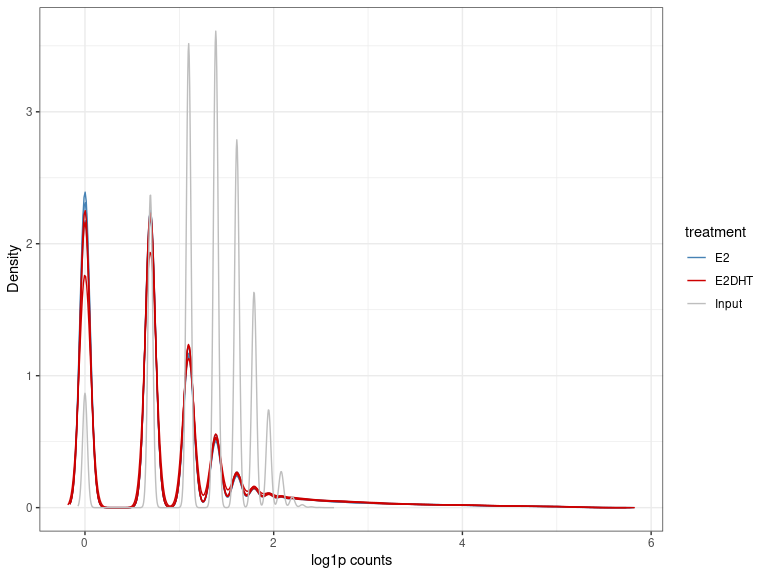
<figcaption aria-hidden="true"><em>Read Densities for the complete set
of sliding windows across all samples</em></figcaption>
</figure>

## Filtering of Sliding Windows

After counting all reads in the sliding genomic windows, the next step
is to discard windows for which counts are unlikely to represent true
signal from our ChIP target. The strategy employed in `extraChIPs` uses
a set of pre-defined regions to automatically set thresholds based on 1)
counts strongly above the counts from the input sample, and 2) the
windows with the overall highest signal. Thresholds are determined such
that a proportion (e.g. `q = 0.5`) of the windows which overlap one of
the supplied consensus peaks will be returned. Higher values for `q`
will return more windows, however many of these will tend to only
marginally overlap a peak in one of the tail regions, and these will
most likely be covered by neighbouring windows. Experience has shown
that values such as `q = 0.5` tend to return a considerable proportion
of windows containing true signal from the ChIP target. Higher values
will tend to return more sliding windows where the edges overlap the
tails of the guide regions.

The we can pass these to the function `dualFilter()` which utilises the
strategy described above. On large datasets, this can be quite
time-consuming, as can the initial counting step. Multiple alternative
filtering strategies are also provided by the package `csaw` and these
can be accessed using `?csaw::filterWindows`

``` r
guide_regions <- here("data", "H3K27ac", "H3K27ac_chr10.bed") %>% 
  import.bed(seqinfo = sq)
filtcounts <- dualFilter(
  x = wincounts[, wincounts$target == "H3K27ac"],
  bg = wincounts[, wincounts$target == "Input"], 
  ref = guide_regions,
  q = 0.6
)
```

Thus we have reduced our initial set of 506,538 sliding windows to the
23,417 windows most likely to contain true signal from our ChIP target.
The returned object will by default contain `counts` and `logCPM`
assays, with the complete library sizes used for the calculation of
`logCPM` values. Similarly, *the input sample is no longer included* in
the data object, although additional columns can easily be added to the
returned object using any number of strategies.

``` r
dim(wincounts)
```

    ## [1] 506538      7

``` r
dim(filtcounts)
```

    ## [1] 23417     6

``` r
assays(filtcounts)
```

    ## List of length 2
    ## names(2): counts logCPM

We can once again check our signal distributions, this time on the
logCPM values.

``` r
plotAssayDensities(filtcounts, assay = "logCPM", colour = "treatment") +
  scale_colour_manual(values = treat_colours) +
  theme_bw()
```

<figure>
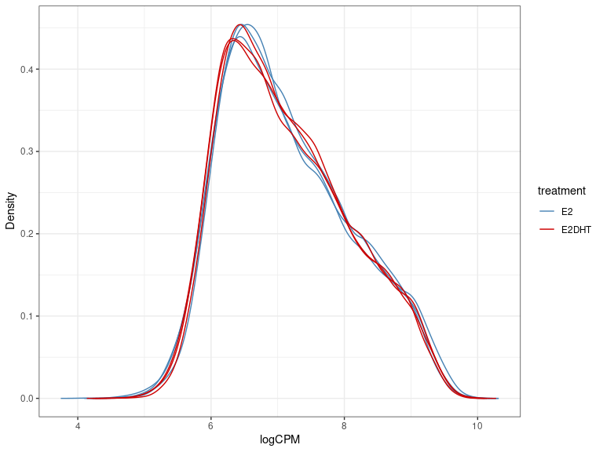
<figcaption aria-hidden="true"><em>Densities for logCPM values across
all samples after discarding windows less likely to contain H3K27ac
signal using <code>dualFilter()</code></em></figcaption>
</figure>

The `rowData` element of the returned object will contain a logical
column indicating where each specific retained window overlapped one of
the supplied consensus peaks.

``` r
rowRanges(filtcounts)
```

    ## GRanges object with 23417 ranges and 1 metadata column:
    ##           seqnames            ranges strand | overlaps_ref
    ##              <Rle>         <IRanges>  <Rle> |    <logical>
    ##       [1]    chr10 42862921-42863040      * |         TRUE
    ##       [2]    chr10 42862961-42863080      * |         TRUE
    ##       [3]    chr10 42863001-42863120      * |         TRUE
    ##       [4]    chr10 42863041-42863160      * |         TRUE
    ##       [5]    chr10 42863081-42863200      * |         TRUE
    ##       ...      ...               ...    ... .          ...
    ##   [23413]    chr10 99895121-99895240      * |         TRUE
    ##   [23414]    chr10 99895161-99895280      * |         TRUE
    ##   [23415]    chr10 99895201-99895320      * |         TRUE
    ##   [23416]    chr10 99895241-99895360      * |         TRUE
    ##   [23417]    chr10 99895281-99895400      * |         TRUE
    ##   -------
    ##   seqinfo: 84 sequences from GRCh37 genome

## Initial Visualisation

Inspecting your data is a common first step, and a common QC step is
Relative Log-Expression (RLE) (Gandolfo and Speed 2018). In the
following, we first inspect the RLE across the entire dataset, followed
by RLE grouping *within treatments*. This can be particularly useful
when distributions vary significantly between treatment groups, such as
may occur with a cytoplasmic to nuclear shift by a given ChIP target.
Here, however, there is minimal difference between the two approaches as
H3K27ac signal tends to be broadly consistent between these treatment
groups.

``` r
a <- plotAssayRle(filtcounts, assay = "logCPM", fill = "treat") +
  geom_hline(yintercept = 0, linetype = 2, colour = "grey") +
  scale_fill_manual(values = treat_colours) +
  ggtitle("RLE: Across All Samples") +
  theme_bw()
b <- plotAssayRle(
  filtcounts, assay = "logCPM", fill = "treat", rle_group = "treat"
) +
  geom_hline(yintercept = 0, linetype = 2, colour = "grey") +
  scale_fill_manual(values = treat_colours) +
  ggtitle("RLE: Within Treatment Groups") +
  theme_bw()
a + b + plot_layout(guides = "collect") + 
  plot_annotation(tag_levels = "A")
```

<figure>

<figcaption aria-hidden="true"><em>RLE plots (A) across all samples and
(B) with values calculated within treatment groups.</em></figcaption>
</figure>

We can also check the samples using a PCA plot, again colouring the
points by treatment group and adding labels, which will repel by default
if the points are shown.

``` r
plotAssayPCA(filtcounts, "logCPM", colour = "treatment", label = "accession") +
  scale_colour_manual(values = treat_colours) +
  theme_bw()
```

<figure>

<figcaption aria-hidden="true"><em>PCA plot based on the logCPM
assay</em></figcaption>
</figure>

## Statistical Testing

Multiple methods are enabled in the package `extraChIPs` via the
function `fitAssayDiff()`, with the possibility of incorporating any
additional normalisation strategies from external packages. The two
basic strategies are 1) Quasi-Likelihood Fits (Lund et al. 2012) and 2)
`limma-trend` (Law et al. 2014). The first approach (method = “qlf”)
uses counts along with any of the normalisation strategies from
`edgeR::calcNormFactors()`, and setting the normalisation method to
“none” is the equivalent of library-size normalisation, which replicates
the default normalisation strategy from DiffBind (Ross-Innes et al.
2012). If choosing to normalise *within treatment groups*, a factor can
be provided via the groups argument, essentially adding this as an
option for all methods provided in `edgeR::calcNormFactors()`. The
second method (method = “lt”) is specifically for logCPM values and
these can be provided as output by `dualFilter()` or may be normalised
using any number of additional methods. In addition to the above
methods, a range-based $H_0$ (McCarthy and Smyth 2009) can be specified
by providing a value to the `fc` or `lfc` arguments, which removes any
need for *post-hoc* filtering and correctly controls the FDR, unlike
*post-hoc* filtering based on a fold-change threshold.

Here, we’ll initially fit our data using Quasi-Likelihood Fits,
library-size normalisation and setting a change in signal beyond the
range of $\pm$ 20% as being of interest. By default, the returned
object, would be a `SummarizedExperiment` object containing the results
from model fitting in the `rowData()` element. However, setting
`asRanges = TRUE` will simply return the set of GRanges along with the
testing results as a stand-alone object.

``` r
X <- model.matrix(~treatment, data = colData(filtcounts))
fit_gr <- fitAssayDiff(filtcounts, design = X, fc = 1.2, asRanges = TRUE)
```

## Merging Windows

After an analysis has been performed, values contained in the output
will be estimated signal (`logCPM`), estimated change (`logFC`) with
both raw and adjusted p-values for all sliding windows. Given the
dependency of neighbouring windows, any adjusted p-values will not be
appropriate and a merging of overlapping and/or neighbouring windows
should be performed. Multiple `csaw` methods are wrapped using
`mergeByCol()`, `mergeBySig()` with minor changes to the returned
object, such as the inclusion of the representative range in the column
`keyval_range`.

For this vignette, we’ll merge using the asymptotically exact harmonic
mean p-value, which can also be used for merging dependent p-values
(Wilson 2019). This approach tests H<sub>0</sub>: no $p$-value in the
set of p-values is significant. When merging windows using the harmonic
mean p-values, instead of values from a representative window, weighted
averages for the expression and logFC estimates are returned using the
weights $w_i = \frac{1}{p_i}$. A representative window, corresponding to
the original window with the lowest p-value is returned.

``` r
results_gr <- mergeByHMP(fit_gr, inc_cols = "overlaps_ref", merge_within = 120) %>% 
  mutate(
    status <- case_when(
      hmp_fdr > 0.05 ~ "Unchanged",
      logFC > 0 ~ "Increased",
      logFC < 0 ~ "Decreased"
    )
  )
arrange(results_gr, hmp)[1:5]
```

    ## GRanges object with 5 ranges and 10 metadata columns:
    ##       seqnames            ranges strand | n_windows      n_up    n_down
    ##          <Rle>         <IRanges>  <Rle> | <integer> <integer> <integer>
    ##   [1]    chr10 79257441-79258720      * |        30         3         0
    ##   [2]    chr10 43689241-43690160      * |        21         2         0
    ##   [3]    chr10 74008161-74008760      * |        13         2         0
    ##   [4]    chr10 63858841-63859040      * |         3         1         0
    ##   [5]    chr10 63859401-63859760      * |         7         1         0
    ##       overlaps_ref            keyval_range    logCPM     logFC         hmp
    ##          <logical>               <GRanges> <numeric> <numeric>   <numeric>
    ##   [1]         TRUE chr10:79257761-79257880   7.02801   1.83161 1.84310e-12
    ##   [2]         TRUE chr10:43689681-43689800   6.50461   1.78769 8.00605e-09
    ##   [3]         TRUE chr10:74008441-74008560   6.49284   1.81722 9.04613e-09
    ##   [4]         TRUE chr10:63858881-63859000   5.99283   1.75275 5.91544e-07
    ##   [5]         TRUE chr10:63859601-63859720   5.99405   1.82278 9.46455e-07
    ##           hmp_fdr status.......
    ##         <numeric>   <character>
    ##   [1] 1.32519e-09     Increased
    ##   [2] 2.16805e-06     Increased
    ##   [3] 2.16805e-06     Increased
    ##   [4] 1.06330e-04     Increased
    ##   [5] 1.36100e-04     Increased
    ##   -------
    ##   seqinfo: 84 sequences from GRCh37 genome

In the above, we returned 19 ranges which we might consider using the
significance threshold $\alpha$ = 0.05. As is common, we can assess our
results using an MA plot. However, given that testing is performed using
sliding windows and merging windows using the harmonic mean will
introduce a bias, we can check using the complete set of sliding windows
and the final set of merged windows. Any bias present in our data will
be visible when using the sliding windows, whilst our final results can
be inspected using the merged windows.

``` r
A <- fit_gr %>% 
  as_tibble() %>% 
  ggplot(aes(logCPM, logFC)) +
  geom_point(alpha = 0.6) +
  geom_smooth(se = FALSE, method = "loess") +
  geom_label(
    aes(label = label),
    data = . %>% 
      summarise(
        n = dplyr::n(),
        logCPM = max(logCPM) - 0.15 * diff(range(logCPM)),
        logFC = max(logFC) - 0.05 * diff(range(logFC)),
        label = glue("{comma(n)}\nSliding Windows")
      )
  ) +
  ylim(range(fit_gr$logFC)) +
  ggtitle("MA Plot: All Retained Sliding Windows")
B <- results_gr %>% 
  as_tibble() %>% 
  mutate(`FDR < 0.05` = hmp_fdr < 0.05) %>% 
  ggplot(aes(logCPM, logFC)) +
  geom_point(aes(colour = `FDR < 0.05`), alpha = 0.6) +
  geom_smooth(se = FALSE, method = "loess") +
  geom_label_repel(
    aes(label = range, colour = `FDR < 0.05`),
    data = . %>% dplyr::filter(hmp_fdr == min(hmp_fdr)),
    show.legend = FALSE
  ) +
  geom_label(
    aes(label = label),
    data = . %>% 
      summarise(
        n = dplyr::n(),
        logCPM = max(logCPM) - 0.15 * diff(range(logCPM)),
        logFC = max(fit_gr$logFC) - 0.05 * diff(range(fit_gr$logFC)),
        label = glue("{comma(n)}\nMerged Windows")
      )
  ) +
  scale_colour_manual(values = c("black", "red")) +
  ylim(range(fit_gr$logFC)) +
  ggtitle("MA Plot: Merged Windows")
A + B + plot_annotation(tag_levels = "A")
```

<figure>

<figcaption aria-hidden="true">MA Plots using A) all sliding windows
(after filtering before merging) and B) the final set of merged windows.
The most highly ranked merged window is also labelled in the set of
merged windows. Blue lines represent a loess curve through the
data.</figcaption>
</figure>

A particularly beneficial feature of this approach is that the final
ranges will be of highly variable width, with this select region of
chromosome 10 producing merged windows ranging from 120bp to 18.88kb, as
may be expected for H3K27ac signal.

``` r
results_gr %>%
  mutate(kb = width/1e3) %>% 
  as_tibble() %>% 
  mutate(`FDR < 0.05` = hmp_fdr < 0.05) %>% 
  ggplot(aes(kb, logCPM, colour = `FDR < 0.05`)) +
  geom_point() +
  scale_x_log10() +
  scale_colour_manual(values = c("black", "red")) +
  labs(x = "Merged Window Size (kb)")
```

<figure>
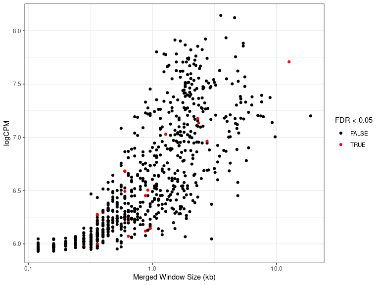
<figcaption aria-hidden="true">Larger windows tend to be associated with
stronger signal. Merged windows which only include 4-5 sliding windows
tend to be associated with low H3K27ac signal. Here one window showing
changed binding is larger than 10kb and we have been able to detect
change somewhere within this range.</figcaption>
</figure>

## Alternative Normalisation Approaches

Using Library Size normalisation, as above, is a conservative approach
and other methods such as RLE (Love, Huber, and Anders 2014) or TMM
(Robinson and Oshlack 2010) may be appropriate. However, these methods
assume that signal distributions are drawn from the same distributions
across all samples, which unlike most RNA-Seq, is not always able to be
safely assumed for ChIP-Seq data. An example may be when an
transcription factor is primarily cytoplasmic in one treatment group,
before being translocated to the nucleus in another treatment. The
Androgen Receptor (*AR*) is a common example of this behaviour.

Whilst H3K27ac signal should remain approximately constant between these
two treatments, we can easily check for differences in data
distributions as well as any GC-bias. The package `quantro` (Hicks and
Irizarry 2015) provides a useful test for any difference in medians as
well as differences in the underlying distributions.

``` r
set.seed(100)
qtest <- assay(filtcounts, "counts") %>% 
  quantro(groupFactor = filtcounts$treatment, B = 1e3)
qtest
```

    ## quantro: Test for global differences in distributions
    ##    nGroups:  2 
    ##    nTotSamples:  6 
    ##    nSamplesinGroups:  3 3 
    ##    anovaPval:  0.49809 
    ##    quantroStat:  0.19728 
    ##    quantroPvalPerm:  0.68

Here, no differences were evident across median values (ANOVA p = 0.498)
or between distributions (p = 0.68) and as such, TMM/RLE normalisation
across all samples may be appropriate.

### TMM Normalisation

To perform an analysis using TMM-normalisation, we can simply specify
this using the argument `norm = "TMM"` when calling `fitAssayDiff()`

``` r
tmm_gr <- fitAssayDiff(
  filtcounts, design = X, fc = 1.2, norm = "TMM", asRanges = TRUE
)
tmm_results <- mergeByHMP(tmm_gr, inc_cols = "overlaps_ref", merge_within = 120) %>% 
  mutate(
    status = case_when(
      hmp_fdr > 0.05 ~ "Unchanged",
      logFC < 0 ~ "Decreased",
      logFC > 0 ~ "Increased"
    )
  )
table(tmm_results$status)
```

    ## 
    ## Increased Unchanged 
    ##        21       698

As might be expected, the results are highly concordant, with
TMM-normalisation providing a moderate improvement in statistical power,
returning 21 windows with evidence of differential signal, instead of
the initial 19. Any of the normalisation methods taken by
`edgeR::calcNormFactors()` can be used here.

If a difference in distributions is found between groups, the
normalisation step can be set to only occur within treatment groups, by
passing the grouping column name to the `groups =` argument. However,
this may exaggerate differences between groups and may introduce false
positives, so should only be used when compelling evidence exists and
the underlying biology supports this.

Checking MA-plots shows that the very slight negative bias in
higher-signal windows when using library size normalisation, as seen
above, was lessened after TMM normalisation.

``` r
tmm_gr %>% 
  as_tibble() %>% 
  ggplot(aes(logCPM, logFC)) +
  geom_point(alpha = 0.6) +
  geom_smooth(se = FALSE, method = "loess") +
  ggtitle("MA Plot: TMM Normalisation")
```

<figure>
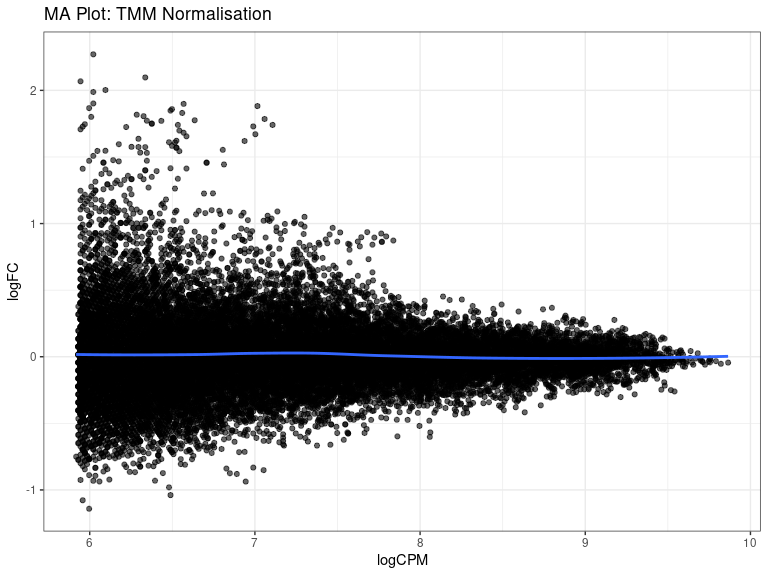
<figcaption aria-hidden="true">MA plot for all sliding windows using TMM
normalisation. The blue line corresponds to a loess curve fitted through
the points.</figcaption>
</figure>

### GC Bias

As GC-bias is a known issue in high-throughput sequencing, additional
packages such as `cqn` can also be incorporated in an analytic workflow
with `extraChIPs`. Firstly, we need to find the GC-content for each of
the initial sliding windows. The UCSC-derived version of the genome
contains this information, but first we’ll have to modify the seqinfo
objects to ensure we’re able to obtain data from the correct location.

``` r
hg19 <- BSgenome.Hsapiens.UCSC.hg19
sq_hg19 <- seqinfo(hg19) 
ranges_hg19 <- rowRanges(filtcounts) %>% 
  keepStandardChromosomes() %>% 
  sortSeqlevels()
seqlevels(ranges_hg19) <- seqlevels(sq_hg19)
seqinfo(ranges_hg19) <- sq_hg19
gc <- getSeq(hg19, ranges_hg19) %>% 
  letterFrequency(letters = "GC", as.prob = TRUE)
rowData(filtcounts)$gc <- gc[,1]
```

Now we’ve obtained this information, we can check for any bias in our
data by plotting logFC estimates as a function of GC content for the
complete set of sliding windows. For our data, minimal bias is evident,
with a possible, but slight, downwards bias in the low-GC windows when
using Library-Size normalisation only.

``` r
A <- fit_gr %>% 
  mutate(gc = gc[,1]) %>% 
  as_tibble() %>% 
  ggplot(aes(gc, logFC)) +
  geom_point() +
  geom_smooth(se = FALSE) +
  scale_x_continuous(name = "GC Content", labels = percent) +
  ggtitle("GC-Bias: Library Size Normalisation")
B <- tmm_gr %>% 
  mutate(gc = gc[,1]) %>% 
  as_tibble() %>% 
  ggplot(aes(gc, logFC)) +
  geom_point() +
  geom_smooth(se = FALSE) +
  scale_x_continuous(name = "GC Content", labels = percent) +
  ggtitle("GC-Bias: TMM Normalisation")
A + B + plot_annotation(tag_levels = "A")
```

<figure>
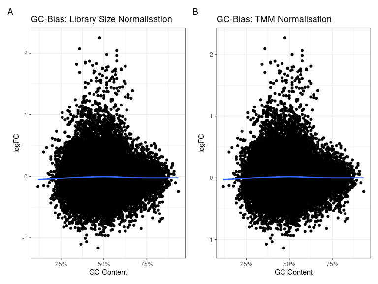
<figcaption aria-hidden="true">GC-Content Vs estimated logFC when using
A) library-size normalisation and B) TMM normalisation</figcaption>
</figure>

If we’re concerned about bias in our data, we can use an approach like
Conditional-Quantile normalisation (Hansen, Irizarry, and Wu 2012) to
correct for this, using fixed-length windows whilst still incorporating
any GC bias. We can also store the normalised logCPM values as a new
assay.

``` r
cqn <- cqn(
  counts = assay(filtcounts, "counts"), 
  x = rowData(filtcounts)$gc, sizeFactors = filtcounts$totals,
  lengths = width(filtcounts), lengthMethod = "fixed"
)
assay(filtcounts, "norm_logCPM") <- cqn$y + cqn$offset
cqnplot(
  cqn, 
  col = treat_colours[as.character(filtcounts$treatment)], 
  xlab = "GC Content"
)
```

<figure>
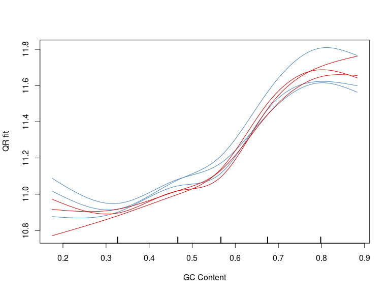
<figcaption aria-hidden="true">Systemic impacts of GC content across all
samples. A clear bias is evident through the middle range of the data,
with a degree of variability again seen in the high-GC and low-GC
windows.</figcaption>
</figure>

We can check the impact of normalisation using PCA.

``` r
plotAssayPCA(
  filtcounts, assay = "norm_logCPM", colour = "treatment", label = "accession"
) +
  scale_colour_manual(values = treat_colours) +
  theme_bw()
```

<figure>
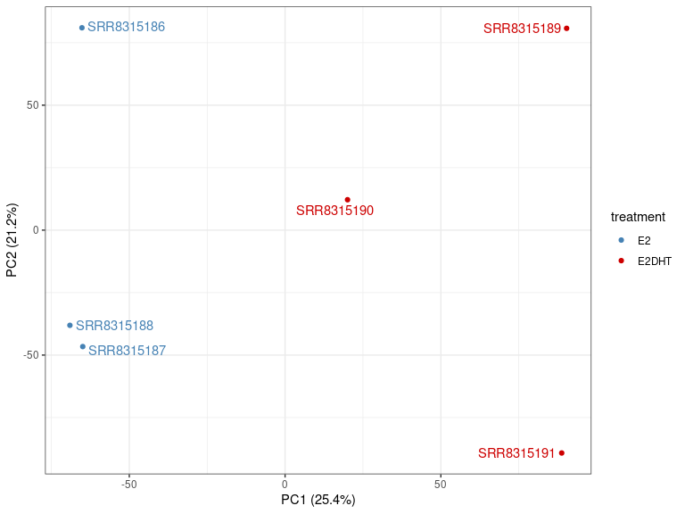
<figcaption aria-hidden="true">PCA plot of CQ-Normalised logCPM
values</figcaption>
</figure>

The function `cqn()` also returns a matrix of offsets able to supplied
to a `DGEList`, and these can also be passed via `plotAssayDiff()`. As
these offsets are use for normalisation, no other method is required.

``` r
cqn_gr <- fitAssayDiff(
  filtcounts, design = X, fc = 1.2, offset = cqn$glm.offset, asRanges = TRUE
)
cqn_results <- mergeByHMP(cqn_gr, inc_cols = "overlaps_ref", merge_within = 120)
```

This approach has returned fewer results, with only 16 merged windows
being considered significant, when accounting for GC-bias, however this
is likely to reflect a more accurate set of results, particularly if
setting `fc = 0` as a less stringent hypothesis test.

Again we can check for bias using an MA plot, along with the GC-bias
plot

``` r
A <- cqn_gr %>% 
  as_tibble() %>% 
  ggplot(aes(logCPM, logFC)) +
  geom_point(alpha = 0.6) +
  geom_smooth(se = FALSE) +
  ylim(range(fit_gr$logFC)) +
  ggtitle("MA Plot: All Sliding Windows (CQN)")
B <- cqn_gr %>% 
  as_tibble() %>% 
  ggplot(aes(gc, logFC)) +
  geom_point() +
  geom_smooth(se = FALSE) +
  scale_x_continuous(name = "GC Content", labels = percent) +
  ggtitle("GC-Bias: CQ Normalisation")
A + B + plot_annotation(tag_levels = "A")
```

<figure>
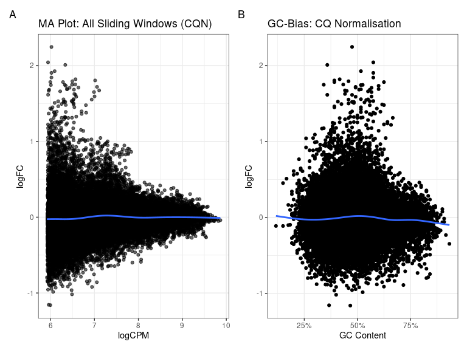
<figcaption aria-hidden="true">QC plots for results using CQN, including
an A) MA-plot and B) GC-bias plot. The minimal bias oberserved
previously for low-GC regions appears to have been rectified, however,
higher GC regions appear less satisfactory in this dataset.</figcaption>
</figure>

Results can be compared to any of the previous approaches, and it
appears that using CQN has led to slightly more conservative estimates
of fold-change.

``` r
tibble(TMM = tmm_gr$logFC, CQN = cqn_gr$logFC) %>% 
  ggplot(aes(TMM, CQN)) +
  geom_point(alpha = 0.6) +
  geom_abline() +
  geom_smooth(se = FALSE, method = "lm")
```

<figure>
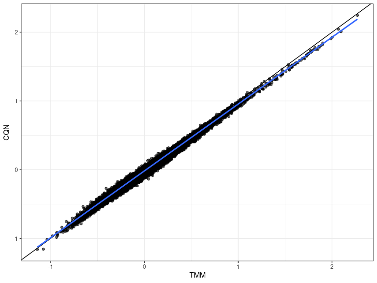
<figcaption aria-hidden="true">Comparison of logFC estimates obtained
using TMM and CQ normalisation. The black line represents y = x, whilst
the regression line is shown in blue. A slight downwards bias was
evident in CQN-derived estimates.</figcaption>
</figure>

As a further alternative, we could fit the CQ-normalised logCPM values
using `limma-trend`, by passing this assay and setting `method = "lt"`.
However, Quasi-likelihood models are generally preferred.

``` r
cqn_lt_gr <- fitAssayDiff(
  filtcounts, assay = "norm_logCPM", design = X, fc = 1.2, 
  method = "lt", asRanges = TRUE
)
cqn_lt_results <- mergeByHMP(cqn_lt_gr, inc_cols = "overlaps_ref", merge_within = 120)
```

# Mapping of Windows

## Mapping to Genes

Once the changes in signal for our given ChIP target have been
determined, a common next step is to assess which genes are likely to be
impacted. Whilst no definitive, single methodology exists for this
process, the function `mapByFeature()` offers an intuitive approach,
taking into account any previously defined regulatory features. These
regulatory features may be defined by simple proximity to TSS regions,
by histone marks, downloaded from external repositories or any other
possibility. Whilst these features can improve the precision of mapping,
even without these this function can still enable a useful assignment of
target gene to binding event.

The process undertaken inside `mapByFeature()` is a sequential checking
of each range’s association with regulatory features and the most likely
target as a result. These steps are:

1.  **Check for any HiC interactions**
    - All genes which directly overlap an interaction anchor are
      considered part of the regulatory network for that interaction,
      and as such, all genes associated with both anchors are assigned
      to a peak which overlaps a HiC Interaction
2.  **Check for any overlaps with a promoter**
    - All genes regulated by that promoter are assigned as regulatory
      targets. By default, this is by direct promoter/gene overlap
      (`prom2gene = 0`)
3.  **Check for any overlaps with an enhancer**
    - Peaks which overlap an enhancer are assigned to *all* genes within
      the distance specified by `enh2gene` (default = 100kb)
4.  **Check for genes with no previous mappings**
    - Peaks *with no previous mappings* are assigned to all directly
      overlapping genes, or the *nearest* gene within a specified
      distance (default `gr2gene` = 100kb)

If no promoters, enhancers or long-range interactions are supplied, all
genes will be simply mapped to ChIP-Seq regions using step 4.

A GTF of annotations can be used, with the following being the genes,
transcripts and exons from chr10, taken from [Gencode
v43](https://www.gencodegenes.org/human/release_43lift37.html). Whilst
this example relies on this format, any additional resource such as an
`EnsDb` or `TxDb` object could easily be used. Here, we’ll load the data
then split into a `GRangesList` with separate elements for genes,
transcripts and exons.

``` r
gencode <- here("data/gencode.v43lift37.chr10.annotation.gtf.gz") %>% 
  import.gff() %>% 
  filter_by_overlaps(GRanges("chr10:42354900-100000000")) %>% 
  split(.$type)
seqlevels(gencode) <- seqlevels(sq)
seqinfo(gencode) <- sq
```

Now we’ve loaded our gene annotations at multiple levels, we can easily
define Transcription Start Sites (TSS) using transcript definitions and
the function `reduceMC()`. This function is an extension of
`GenomicRanges::reduce()` which retains all supplied columns in the
`mcols()` element by collapsing these into `CompressedList` columns, and
simplifying to vectors where possible.

``` r
tss <- gencode$transcript %>% 
  resize(width = 1, fix = "start") %>% 
  select(gene_id, ends_with("name")) %>% 
  reduceMC(min.gapwidth = 0)
```

Checking the TSS for *PPIF* shows we have one site which 3 transcripts
start at, along with two more unique to specific transcripts.

``` r
subset(tss, vapply(gene_name, function(x) "PPIF" %in% x, logical(1)))
```

    ## GRanges object with 3 ranges and 3 metadata columns:
    ##       seqnames    ranges strand |              gene_id       gene_name
    ##          <Rle> <IRanges>  <Rle> |      <CharacterList> <CharacterList>
    ##   [1]    chr10  81107225      + | ENSG00000108179.14_6            PPIF
    ##   [2]    chr10  81107256      + | ENSG00000108179.14_6            PPIF
    ##   [3]    chr10  81107414      + | ENSG00000108179.14_6            PPIF
    ##                  transcript_name
    ##                  <CharacterList>
    ##   [1] PPIF-205,PPIF-203,PPIF-201
    ##   [2]                   PPIF-204
    ##   [3]                   PPIF-202
    ##   -------
    ##   seqinfo: 84 sequences from GRCh37 genome

We can also add the TSS overlap status to our set of results

``` r
tmm_results$tss <- overlapsAny(tmm_results, tss)
```

Next we’ll want to map our regions to genes. To use the methods
available in `mapByFeature()` let’s define a set of promoters. First
we’ll create a promoter for each transcript, then we can merge any
overlapping promoters using `reduceMC()`. (Setting `simplify = FALSE`
avoids an issue in this subset of genes where one gene has multiple IDs,
and helps retain a 1:1 mapping between IDs and genes.) Importantly, this
will give a set of promoters which are unique and non-overlapping but
with variable width and with the complete set of transcripts that may be
regulated by the promoter listed. As can be seen, 4 potential promoter
regions are found for *CRTAC1*

``` r
promoters <- gencode$transcript %>% 
    select(gene_id, ends_with("name")) %>% 
    promoters(upstream = 2500, downstream = 500) %>% 
    reduceMC(simplify = FALSE)
tail(promoters)
```

    ## GRanges object with 6 ranges and 3 metadata columns:
    ##       seqnames            ranges strand |
    ##          <Rle>         <IRanges>  <Rle> |
    ##   [1]    chr10 99609056-99612055      - |
    ##   [2]    chr10 99635155-99638154      - |
    ##   [3]    chr10 99643500-99646805      - |
    ##   [4]    chr10 99695536-99698535      - |
    ##   [5]    chr10 99770595-99773594      - |
    ##   [6]    chr10 99789879-99793085      - |
    ##                                           gene_id       gene_name
    ##                                   <CharacterList> <CharacterList>
    ##   [1]                        ENSG00000227356.2_10      GOLGA7B-DT
    ##   [2]                           ENSG00000265398.1      AL139239.1
    ##   [3] ENSG00000095713.14_13,ENSG00000095713.14_13   CRTAC1,CRTAC1
    ##   [4]                       ENSG00000095713.14_13          CRTAC1
    ##   [5]                       ENSG00000095713.14_13          CRTAC1
    ##   [6] ENSG00000095713.14_13,ENSG00000095713.14_13   CRTAC1,CRTAC1
    ##             transcript_name
    ##             <CharacterList>
    ##   [1]        GOLGA7B-DT-201
    ##   [2]        AL139239.1-201
    ##   [3] CRTAC1-205,CRTAC1-206
    ##   [4]            CRTAC1-204
    ##   [5]            CRTAC1-201
    ##   [6] CRTAC1-203,CRTAC1-202
    ##   -------
    ##   seqinfo: 84 sequences from GRCh37 genome

``` r
tmm_results <- mapByFeature(
  tmm_results, genes = gencode$gene,
  prom = select(promoters, gene_id, gene_name)
)
tmm_results %>% filter(hmp_fdr < 0.05) %>% arrange(hmp)
```

    ## GRanges object with 21 ranges and 13 metadata columns:
    ##        seqnames            ranges strand | n_windows      n_up    n_down
    ##           <Rle>         <IRanges>  <Rle> | <integer> <integer> <integer>
    ##    [1]    chr10 79257441-79258720      * |        30         3         0
    ##    [2]    chr10 43689241-43690160      * |        21         2         0
    ##    [3]    chr10 74008161-74008760      * |        13         2         0
    ##    [4]    chr10 63858841-63859040      * |         3         1         0
    ##    [5]    chr10 63859401-63859760      * |         7         1         0
    ##    ...      ...               ...    ... .       ...       ...       ...
    ##   [17]    chr10 79307081-79307960      * |        20         2         0
    ##   [18]    chr10 74014401-74015360      * |        22         3         0
    ##   [19]    chr10 90615361-90615640      * |         4         2         0
    ##   [20]    chr10 63696921-63697240      * |         6         3         0
    ##   [21]    chr10 74878001-74878360      * |         7         3         0
    ##        overlaps_ref            keyval_range    logCPM     logFC         hmp
    ##           <logical>               <GRanges> <numeric> <numeric>   <numeric>
    ##    [1]         TRUE chr10:79257761-79257880   7.02793   1.85621 6.20766e-13
    ##    [2]         TRUE chr10:43689681-43689800   6.51086   1.81157 4.45187e-09
    ##    [3]         TRUE chr10:74008441-74008560   6.49275   1.84270 5.07996e-09
    ##    [4]         TRUE chr10:63858881-63859000   5.99257   1.77724 4.03575e-07
    ##    [5]         TRUE chr10:63859601-63859720   5.99366   1.84777 6.37775e-07
    ##    ...          ...                     ...       ...       ...         ...
    ##   [17]         TRUE chr10:79307441-79307560   6.45271   1.15247 0.000563495
    ##   [18]         TRUE chr10:74015201-74015320   6.14440   1.26391 0.000592892
    ##   [19]         TRUE chr10:90615361-90615480   5.97947   1.14308 0.000804490
    ##   [20]         TRUE chr10:63697121-63697240   6.00058   1.11473 0.001074487
    ##   [21]         TRUE chr10:74878201-74878320   6.19539   1.05769 0.001437350
    ##            hmp_fdr      status       tss               gene_id       gene_name
    ##          <numeric> <character> <logical>       <CharacterList> <CharacterList>
    ##    [1] 4.46331e-10   Increased     FALSE ENSG00000156113.25_17          KCNMA1
    ##    [2] 1.21750e-06   Increased     FALSE ENSG00000198915.12_14        RASGEF1A
    ##    [3] 1.21750e-06   Increased     FALSE   ENSG00000166295.9_6         ANAPC16
    ##    [4] 7.25426e-05   Increased     FALSE ENSG00000150347.17_12          ARID5B
    ##    [5] 9.17121e-05   Increased     FALSE ENSG00000150347.17_12          ARID5B
    ##    ...         ...         ...       ...                   ...             ...
    ##   [17]   0.0236827   Increased     FALSE ENSG00000156113.25_17          KCNMA1
    ##   [18]   0.0236827   Increased     FALSE   ENSG00000289506.2_2 ENSG00000289506
    ##   [19]   0.0304436   Increased     FALSE   ENSG00000152766.6_8         ANKRD22
    ##   [20]   0.0386278   Increased     FALSE ENSG00000150347.17_12          ARID5B
    ##   [21]   0.0492121   Increased     FALSE  ENSG00000166321.14_7          NUDT13
    ##   -------
    ##   seqinfo: 84 sequences from GRCh37 genome

So now we have our regions showing differential signal, along with which
gene they are most likely to be impacting, and whether they directly
overlap the TSS. This can all be summarised into a single MA-plot for
presentation of final results.

``` r
status_colours <- c(Unchanged = "grey70", Increased = "red3", Decreased = "royalblue")
tmm_results %>% 
  as_tibble() %>% 
  ggplot(aes(logCPM, logFC, colour = status, shape = tss)) +
  geom_point() +
  geom_label_repel(
    aes(label = label),
    data = . %>% 
      arrange(hmp) %>% 
      dplyr::slice(1:20) %>% 
      mutate(
        label  = vapply(gene_name, paste, character(1), collapse = "; ") %>% 
          str_trunc(30)
      ),
    fill = "white", alpha = 0.6, show.legend = FALSE
  ) +
  scale_colour_manual(values = status_colours) +
  scale_shape_manual(values = c(19, 21))
```

<figure>

<figcaption aria-hidden="true">MA-plot with the top 20 regions by
significance labelled according to the most likely gene influenced by
the detected signal. Regions which directly overlap a TSS are shown as
empty circles</figcaption>
</figure>

## Mapping to Regions

In addition to which gene is likely to be directly impacted by the
detected signal, knowing which type of regulatory region signal was
observed in is another question commonly asked of ChIP-Seq data. We’ve
already defined our promoters, so let’s keep using `reduceMC()` along
with `setdiffMC()` to define unique *upstream promoter*, *exon*,
*intron* and *intergenic* regions in a hierarchical manner such that
each nucleotide only belongs to one type of region.

First we’ll shift our start sites upstream by 2.5kb, then we can extend
another 2.5kb to define regions 5kb upstream from a TSS. Then we’ll
merge overlapping regions using `reduceMC()` and separate these from any
promoters we’ve already defined using `setdiffMC()`

``` r
regions <- GRangesList(promoter = promoters)
regions$upstream <- gencode$transcript %>% 
  select(gene_id, ends_with("name")) %>% 
  resize(width = 1, fix = "start") %>% 
  shift_upstream(2500) %>% 
  promoters(upstream = 2500, downstream = 0) %>% 
  reduceMC() %>% 
  setdiffMC(regions$promoter, ignore.strand = TRUE)
```

We can use a similar approach to define exons, not already classified as
being within a promoter, and introns not already assigned as promoters.

``` r
regions$exon <- gencode$exon %>% 
  select(gene_id, ends_with("name")) %>% 
  setdiffMC(unlist(regions), ignore.strand = TRUE) 
regions$intron <- gencode$gene %>% 
  select(gene_id, ends_with("name")) %>% 
  setdiffMC(unlist(regions), ignore.strand = TRUE) 
```

For our intergenic regions, there will be no gene information so we can
simply use the slightly faster `setdiff()` function.

``` r
regions$intergenic <- GRanges("chr10:42354900-100000000") %>% 
  setdiff(unlist(regions), ignore.strand = TRUE)
```

Using the function `bestOverlap()` we can assign each window with
ChIP-Seq signal to the region which it shows the greatest overlap,
setting this as a factor which reflects the hierarchy with which the
regions were defined.

``` r
tmm_results$bestOverlap <- bestOverlap(tmm_results, regions) %>% 
  factor(levels = names(regions))
tmm_results %>% filter(hmp_fdr < 0.05, bestOverlap == "promoter")
```

    ## GRanges object with 2 ranges and 14 metadata columns:
    ##       seqnames            ranges strand | n_windows      n_up    n_down
    ##          <Rle>         <IRanges>  <Rle> | <integer> <integer> <integer>
    ##   [1]    chr10 76779561-76780200      * |        14         4         0
    ##   [2]    chr10 79623321-79635960      * |       314        13         0
    ##       overlaps_ref            keyval_range    logCPM     logFC         hmp
    ##          <logical>               <GRanges> <numeric> <numeric>   <numeric>
    ##   [1]         TRUE chr10:76779721-76779840   6.21638  1.244849 0.000194483
    ##   [2]         TRUE chr10:79630321-79630440   7.71543  0.906496 0.000100434
    ##          hmp_fdr      status       tss
    ##        <numeric> <character> <logical>
    ##   [1] 0.00932221   Increased     FALSE
    ##   [2] 0.00515801   Increased      TRUE
    ##                                         gene_id            gene_name
    ##                                 <CharacterList>      <CharacterList>
    ##   [1]                     ENSG00000156650.14_17                KAT6B
    ##   [2] ENSG00000204049.1_8,ENSG00000151208.17_11 ENSG00000204049,DLG5
    ##       bestOverlap
    ##          <factor>
    ##   [1]    promoter
    ##   [2]    promoter
    ##   -------
    ##   seqinfo: 84 sequences from GRCh37 genome

# Visualisation of Results

## Pie Charts

Now that we’ve assigned each window to a genomic regions, we can use
`plotPie()` to view the distribution of ChIP-Seq signal within these
regions. First we’ll define a consistent colour palette for these
regions in all plots.

``` r
region_colours <- hcl.colors(length(regions), "Viridis", rev = TRUE)
names(region_colours) <- names(regions)
plotPie(tmm_results, fill = "bestOverlap") +
  scale_fill_manual(values = region_colours)
```

<figure>
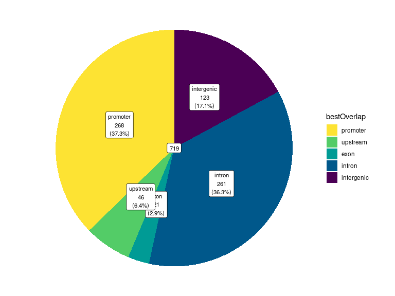
<figcaption aria-hidden="true">Pie chart showing the distribution of
ChIP-Seq signal within our defined genomic regions.</figcaption>
</figure>

Labels produced using `plotPie()` use the `glue()` syntax and are able
to access the summarised data using `N` as the overall total number of
sites. as well as `.data[[fill]]` to access data in the column selected
to fill the pie segments. Totals and percentages within each segment are
accessible using `n` and `p` respectively as these are columns within
the internal `data.frame` formed when creating the plot. External
formatting functions such as `comma()`, `percent()` or `str_to_title()`
can also be put to good use here.

``` r
plotPie(
  tmm_results, fill = "bestOverlap",
  cat_glue = "{str_to_title(.data[[fill]])}\n{comma(n, 1)}\n({percent(p, 0.1)})"
) +
  scale_fill_manual(values = region_colours)
```

<figure>

<figcaption aria-hidden="true">Pie chart showing customised labels. Here
the regions have been modified to use title case in the labels, but
without modifying the underlying data.</figcaption>
</figure>

In addition to highly customisable labels, segments can be scaled by
width to produce segments representing the overlaps in kb instead of
counts.

``` r
plotPie(
  tmm_results, fill = "bestOverlap", scale_by = "width",
  total_glue = "{comma(N)}kb", total_size = 5,
  cat_glue = "{str_to_title(.data[[fill]])}\n({percent(p, 0.1)})",
  cat_size = 4, cat_adj = 0.1, min_p = 0.04
) +
  scale_fill_manual(values = region_colours)
```

<figure>
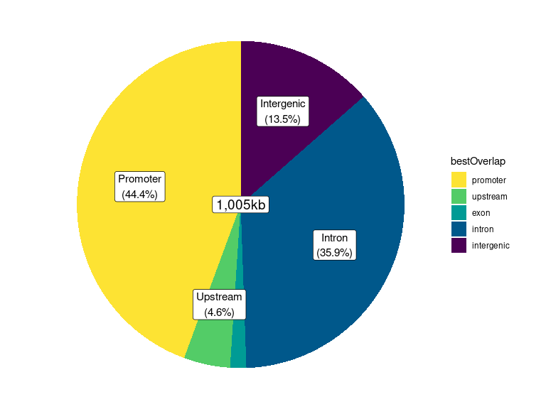
<figcaption aria-hidden="true">Pie chart with sgments scaled by width of
ChIP-Seq regions</figcaption>
</figure>

## Split Donut Charts

Pie charts can be further extended into Split-Donut charts, with data in
two rings. The default settings can be used to add the status of each
window to the overlapping regions.

``` r
plotSplitDonut(
  tmm_results, inner = "bestOverlap", outer = "status",
  inner_palette = region_colours
)
```

<figure>

<figcaption aria-hidden="true">Split-Donut chart showing status with
overlapping region</figcaption>
</figure>

A key advantage of `plotSplitDonut()` is the ability to provide separate
colour palettes for the inner & outer rings

``` r
plotSplitDonut(
  tmm_results, inner = "bestOverlap", outer = "status", 
  inner_palette = region_colours, outer_palette = status_colours
)
```

<figure>
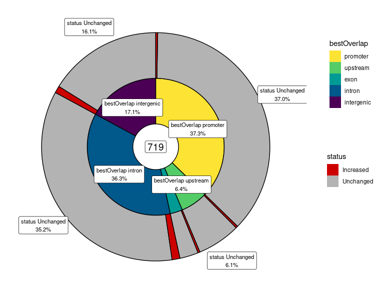
<figcaption aria-hidden="true">Split-Donut chart using separate colour
palettes for inner and outer rings</figcaption>
</figure>

Once again these are heavily customisable using the `glue()` syntax for
labels and exploding key segments of interest.

``` r
plotSplitDonut(
  tmm_results, inner = "bestOverlap", outer = "status", 
  inner_palette = region_colours, outer_palette = status_colours,
  inner_glue = "{str_to_title(.data[[inner]])}\nn = {comma(n)}\n{percent(p,0.1)}",
  outer_glue = "{.data[[outer]]}\n{str_to_title(.data[[inner]])}\nn = {n}",
  explode_outer = "(In|De)creased", explode_r = 0.3, 
  outer_label = "text", outer_min_p = 0, outer_max_p = 0.02
)
```

<figure>

<figcaption aria-hidden="true">Split-Donut chart exploding key regions
and customising labels.</figcaption>
</figure>

## Coverage Plots

In order to show our changed signal in context we can show the coverage
using a `BigWigFileList` and the function `plotHFGC()`, which stands for
plot **H**iC, **F**eatures, **G**enes and **C**overage, with tracks
appearing in that order. `plotHFGC()` wraps multiple calls to the
package `Gviz` (Hahne and Ivanek 2016) to simplify repetitive plot
generation but retain significant flexibility. All tracks are options,
with the minimal requirements being cytogenetic bands along with a
specified GenomicRange. However, this does restrict plotting to the
“Standard Chromosomes”.

Coverage is produced using BigWig Files, passed to `plotHFGC()` as
either a `BigWigFileList` (for separate tracks) or a list of
`BigWigFileList` objects, for multiple tracks with individual samples
overlaid.

``` r
bwfl <- here::here(
  "data", "H3K27ac", glue("{levels(samples$treatment)}_cov_chr10.bw")
) %>% 
  BigWigFileList() %>% 
  setNames(levels(samples$treatment))
```

We can also include cytogenetic bands for these coverage plots, some of
which are provided with `extraChIPs`.

``` r
data("grch37.cytobands")
head(grch37.cytobands)
```

    ##   chrom chromStart chromEnd   name gieStain
    ## 1  chr1          0  2300000 p36.33     gneg
    ## 2  chr1    2300000  5400000 p36.32   gpos25
    ## 3  chr1    5400000  7200000 p36.31     gneg
    ## 4  chr1    7200000  9200000 p36.23   gpos25
    ## 5  chr1    9200000 12700000 p36.22     gneg
    ## 6  chr1   12700000 16200000 p36.21   gpos50

Let’s check the coverage across the most highly-ranked region with
default settings. By default, the specified range will be outlined
(i.e. highlighted) with a blue rectangle which is able to be turned off
and customised as the user sees fit.

``` r
gr <- filter(tmm_results, hmp_fdr < 0.05, bestOverlap == "promoter")[1]
gr <- keepStandardChromosomes(gr)
plotHFGC(gr, cytobands = grch37.cytobands, coverage = bwfl)
```

<figure>

<figcaption aria-hidden="true">Generic figure from plotHFGC showing
coverage for the selected region only</figcaption>
</figure>

The y-axes for the two treatments are clearly different and we can use
the same colour scheme as previously. We can overlap the two treatments
by providing the coverage as a list of `BigWigFileList` objects. Colours
will need to now be provided in a list with matching structure. Zooming
out may also give a little better context

``` r
cov_list <- list(H3K27ac = bwfl)
cov_colour <- list(H3K27ac = treat_colours[levels(samples$treatment)])
plotHFGC(
  gr, cytobands = grch37.cytobands, 
  coverage =  cov_list, linecol = cov_colour, zoom = 50, rotation.title = 90
)
```

<figure>
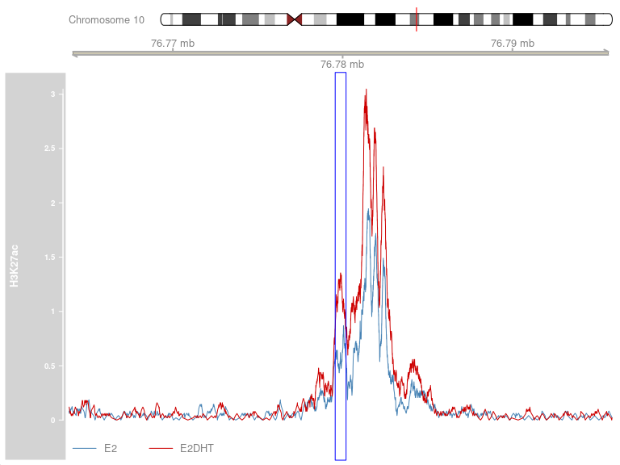
<figcaption aria-hidden="true">Zoomed out version of the above with
coverage plots set to overlap</figcaption>
</figure>

### Displaying Genes

Next we might like to add gene models to provide the regulatory context.
These are supplied here in the layout required by the defaults of the
`GeneRegionTrack()` function, with all exons and transcripts annotated.

``` r
gene_models <- gencode$exon %>% 
  select(
    type, gene = gene_id, exon = exon_id, transcript = transcript_id, 
    symbol = gene_name
  ) %>% 
  keepStandardChromosomes()
```

``` r
plotHFGC(
  gr, cytobands = grch37.cytobands, 
  coverage =  cov_list, linecol = cov_colour,
  genes = gene_models, genecol = "wheat", collapseTranscripts = FALSE,
  zoom = 50, rotation.title = 90, covsize = 10, genesize = 1
)
```

<figure>
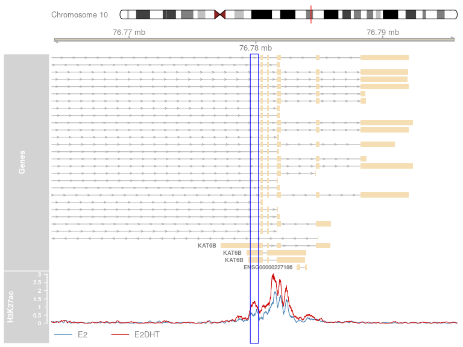
<figcaption aria-hidden="true"><em>Coverage for our region showing the
relationship of signal to annotated genes</em></figcaption>
</figure>

### Adding Features

Another useful track to add might be some key features such as promoters
and other annotated regions, as we have formd earlier in the workflow.
Features must **always** be a `GRangesList`, with each element defining
a different type of feature, as we already have in our `regions_gr`
object. For multiple feature tracks, a list of `GRangesList` objects can
be passed.

``` r
regions <- keepStandardChromosomes(regions)
plotHFGC(
  gr, cytobands = grch37.cytobands, 
  features = regions, featcol = region_colours, featstack = "dense",
  coverage =  cov_list, linecol = cov_colour,
  genes = gene_models, genecol = "wheat", collapseTranscripts = FALSE,
  zoom = 50, rotation.title = 90, covsize = 10, genesize = 1, featsize = 5
)
```

<figure>
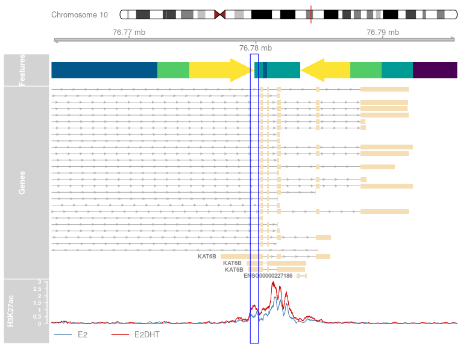
<figcaption aria-hidden="true"><em>The same figure as previously, but
with annotated regions added as features. Any type of feature can be
added here.</em></figcaption>
</figure>

### Adding Annotations To Coverage

An indication of which regions are associated with increased or
decreased ChIP signal can also be a useful annotation to add to plots
such as the above. Using the status from our differential signal
testing, we can create a `GRangesList` with te various regions annotated
as Increased, Unchanged etc,

Similar to the features track, where the names of `GRangesList` elements
denote the different feature types, able to then assigned a colour,
coverage annotation tracks follow these same rules. For each coverage
track being annotated, a `GRangesList` object can denote the ranges
which can be assigned different colours. Annotation tracks should be
passed to `plotHFGC()` using the same structure as the coverage tracks,
so here if we pass the annotations as a list with the single element
`H3K27ac` these annotations will be added directly above the coverage
track for H3K27ac signal.

``` r
cov_annot <- splitAsList(tmm_results, tmm_results$status) %>% 
  endoapply(granges) %>% 
  keepStandardChromosomes()
cov_annot <- list(H3K27ac = cov_annot)
```

In our final plot, we’ll zoom out to the entire region covered by
*KAT6B*, showing all transcripts, with out original region highlighted
in blue. All merged windows for which a differential signal test was
performed will be annotated with colours indicating the result for that
window. As can be seen multiple H3K27ac signal regions appear to be
responding to DHT treatment for *KAT6B* with a possible intronic
enhancer and alternative promoter being most likely impacted, including
the neghbouring region to our initial range. In contradst, the primary
promoter appears unaffected by DHT treatment.

``` r
plotHFGC(
  gr, cytobands = grch37.cytobands, 
  features = regions, featcol = region_colours, featstack = "dense",
  coverage =  cov_list, linecol = cov_colour,
  genes = gene_models, genecol = "wheat", collapseTranscripts = FALSE,
  zoom = 350, shift = -1e5,
  rotation.title = 90, covsize = 10, genesize = 1, featsize = 5,
  annotation = cov_annot, annotcol = status_colours[c("Unchanged", "Increased")]
)
```

<figure>
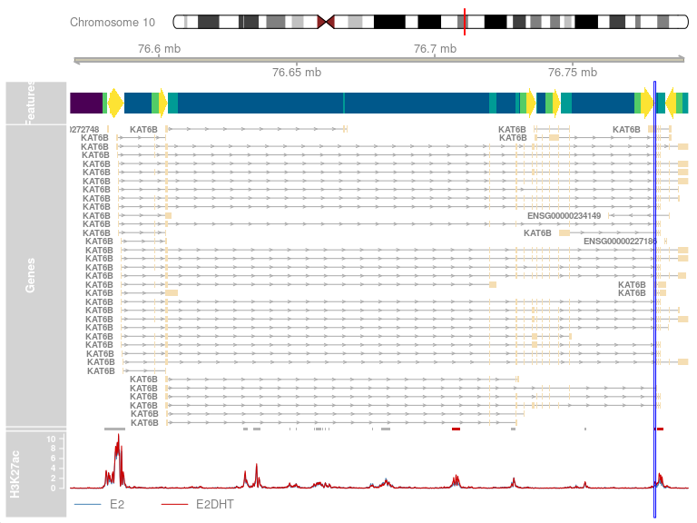
<figcaption aria-hidden="true"><em>The addition of an annotation track
for the coverage tracks shows which regions were retained during the
analysis, as well as those which were considered as showing changed or
unchanged signal.</em></figcaption>
</figure>

Plots are able to be tweaked considerably further via multiple
parameters, however these basic approaches cover the core functionality
of `plotHFGC()` for enabling simple & reproducible plotting across
regions for multiple sites within a larger experiment.

If long-range interactions are available, these can also be provided as
a GenomicInteractions object, completing all available options for the
HFGC components.

# References

<div id="refs" class="references csl-bib-body hanging-indent">

<div id="ref-edgeR2016" class="csl-entry">

Chen, Yunshun, Aaron A T Lun, and Gordon K Smyth. 2016. “From Reads to
Genes to Pathways: Differential Expression Analysis of RNA-Seq
Experiments Using Rsubread and the edgeR Quasi-Likelihood Pipeline.”
*F1000Research* 5: 1438.
<https://doi.org/10.12688/f1000research.8987.2>.

</div>

<div id="ref-Gandolfo2018-oc" class="csl-entry">

Gandolfo, Luke C, and Terence P Speed. 2018. “RLE Plots: Visualizing
Unwanted Variation in High Dimensional Data.” *PLoS One* 13 (2):
e0191629.

</div>

<div id="ref-gviz" class="csl-entry">

Hahne, Florian, and Robert Ivanek. 2016. “Statistical Genomics: Methods
and Protocols.” In, edited by Ewy Mathé and Sean Davis, 335–51. New
York, NY: Springer New York.
<https://doi.org/10.1007/978-1-4939-3578-9_16>.

</div>

<div id="ref-Hansen2012-jz" class="csl-entry">

Hansen, Kasper D, Rafael A Irizarry, and Zhijin Wu. 2012. “Removing
Technical Variability in <span class="nocase">RNA-seq</span> Data Using
Conditional Quantile Normalization.” *Biostatistics* 13 (2): 204–16.

</div>

<div id="ref-Hicks2015-ee" class="csl-entry">

Hicks, Stephanie C, and Rafael A Irizarry. 2015. “Quantro: A Data-Driven
Approach to Guide the Choice of an Appropriate Normalization Method.”
*Genome Biol.* 16 (1): 117.

</div>

<div id="ref-Law2014-xq" class="csl-entry">

Law, Charity W, Yunshun Chen, Wei Shi, and Gordon K Smyth. 2014. “Voom:
Precision Weights Unlock Linear Model Analysis Tools for
<span class="nocase">RNA-seq</span> Read Counts.” *Genome Biol.* 15 (2):
R29.

</div>

<div id="ref-DESeq22014" class="csl-entry">

Love, Michael I., Wolfgang Huber, and Simon Anders. 2014. “Moderated
Estimation of Fold Change and Dispersion for RNA-Seq Data with DESeq2.”
*Genome Biology* 15: 550. <https://doi.org/10.1186/s13059-014-0550-8>.

</div>

<div id="ref-csaw2016" class="csl-entry">

Lun, Aaron T L, and Gordon K Smyth. 2016. “Csaw: A Bioconductor Package
for Differential Binding Analysis of ChIP-Seq Data Using Sliding
Windows.” *Nucleic Acids Res.* 44 (5): e45.

</div>

<div id="ref-Lund2012-xo" class="csl-entry">

Lund, Steven P, Dan Nettleton, Davis J McCarthy, and Gordon K Smyth.
2012. “Detecting Differential Expression in
<span class="nocase">RNA-sequence</span> Data Using Quasi-Likelihood
with Shrunken Dispersion Estimates.” *Stat. Appl. Genet. Mol. Biol.* 11
(5).

</div>

<div id="ref-McCarthy2009-qf" class="csl-entry">

McCarthy, Davis J, and Gordon K Smyth. 2009. “Testing Significance
Relative to a Fold-Change Threshold Is a TREAT.” *Bioinformatics* 25
(6): 765–71.

</div>

<div id="ref-Molder2021-mo" class="csl-entry">

Mölder, Felix, Kim Philipp Jablonski, Brice Letcher, Michael B Hall,
Christopher H Tomkins-Tinch, Vanessa Sochat, Jan Forster, et al. 2021.
“Sustainable Data Analysis with Snakemake.” *F1000Res.* 10 (January):
33.

</div>

<div id="ref-Robinson2010-qp" class="csl-entry">

Robinson, Mark D, and Alicia Oshlack. 2010. “A Scaling Normalization
Method for Differential Expression Analysis of
<span class="nocase">RNA-seq</span> Data.” *Genome Biol.* 11 (3): R25.

</div>

<div id="ref-DiffBind2012" class="csl-entry">

Ross-Innes, Caryn S., Rory Stark, Andrew E. Teschendorff, Kelly A.
Holmes, H. Raza Ali, Mark J. Dunning, Gordon D. Brown, et al. 2012.
“Differential Oestrogen Receptor Binding Is Associated with Clinical
Outcome in Breast Cancer.” *Nature* 481: –4.
<http://www.nature.com/nature/journal/v481/n7381/full/nature10730.html>.

</div>

<div id="ref-Wilson2019-ln" class="csl-entry">

Wilson, Daniel J. 2019. “The Harmonic Mean *p*-Value for Combining
Dependent Tests.” *Proc. Natl. Acad. Sci. U. S. A.* 116 (4): 1195–1200.

</div>

</div>

<br>

# Session Info

``` r
sessionInfo()
```

    ## R version 4.3.0 (2023-04-21)
    ## Platform: x86_64-pc-linux-gnu (64-bit)
    ## Running under: Ubuntu 20.04.6 LTS
    ## 
    ## Matrix products: default
    ## BLAS:   /usr/lib/x86_64-linux-gnu/blas/libblas.so.3.9.0 
    ## LAPACK: /usr/lib/x86_64-linux-gnu/lapack/liblapack.so.3.9.0
    ## 
    ## locale:
    ##  [1] LC_CTYPE=en_AU.UTF-8       LC_NUMERIC=C              
    ##  [3] LC_TIME=en_AU.UTF-8        LC_COLLATE=en_AU.UTF-8    
    ##  [5] LC_MONETARY=en_AU.UTF-8    LC_MESSAGES=en_AU.UTF-8   
    ##  [7] LC_PAPER=en_AU.UTF-8       LC_NAME=C                 
    ##  [9] LC_ADDRESS=C               LC_TELEPHONE=C            
    ## [11] LC_MEASUREMENT=en_AU.UTF-8 LC_IDENTIFICATION=C       
    ## 
    ## time zone: Australia/Adelaide
    ## tzcode source: system (glibc)
    ## 
    ## attached base packages:
    ## [1] splines   stats4    stats     graphics  grDevices utils     datasets 
    ## [8] methods   base     
    ## 
    ## other attached packages:
    ##  [1] BSgenome.Hsapiens.UCSC.hg19_1.4.3 BSgenome_1.68.0                  
    ##  [3] ggrepel_0.9.3                     cqn_1.46.0                       
    ##  [5] quantreg_5.95                     SparseM_1.81                     
    ##  [7] preprocessCore_1.62.1             nor1mix_1.3-0                    
    ##  [9] mclust_6.0.0                      quantro_1.34.0                   
    ## [11] magrittr_2.0.3                    here_1.0.1                       
    ## [13] glue_1.6.2                        scales_1.2.1                     
    ## [15] plyranges_1.20.0                  extraChIPs_1.4.2                 
    ## [17] patchwork_1.1.2                   edgeR_3.42.4                     
    ## [19] limma_3.56.1                      rtracklayer_1.60.0               
    ## [21] BiocParallel_1.34.2               csaw_1.34.0                      
    ## [23] SummarizedExperiment_1.30.1       Biobase_2.60.0                   
    ## [25] MatrixGenerics_1.12.0             matrixStats_1.0.0                
    ## [27] Rsamtools_2.16.0                  Biostrings_2.68.1                
    ## [29] XVector_0.40.0                    GenomicRanges_1.52.0             
    ## [31] GenomeInfoDb_1.36.0               IRanges_2.34.0                   
    ## [33] S4Vectors_0.38.1                  BiocGenerics_0.46.0              
    ## [35] lubridate_1.9.2                   forcats_1.0.0                    
    ## [37] stringr_1.5.0                     dplyr_1.1.2                      
    ## [39] purrr_1.0.1                       readr_2.1.4                      
    ## [41] tidyr_1.3.0                       tibble_3.2.1                     
    ## [43] ggplot2_3.4.2                     tidyverse_2.0.0                  
    ## 
    ## loaded via a namespace (and not attached):
    ##   [1] ProtGenerics_1.32.0        bitops_1.0-7              
    ##   [3] httr_1.4.6                 RColorBrewer_1.1-3        
    ##   [5] doParallel_1.0.17          InteractionSet_1.28.0     
    ##   [7] tools_4.3.0                doRNG_1.8.6               
    ##   [9] backports_1.4.1            utf8_1.2.3                
    ##  [11] R6_2.5.1                   HDF5Array_1.28.1          
    ##  [13] mgcv_1.8-42                lazyeval_0.2.2            
    ##  [15] Gviz_1.44.0                rhdf5filters_1.12.1       
    ##  [17] GetoptLong_1.0.5           withr_2.5.0               
    ##  [19] prettyunits_1.1.1          gridExtra_2.3             
    ##  [21] base64_2.0.1               VennDiagram_1.7.3         
    ##  [23] cli_3.6.1                  formatR_1.14              
    ##  [25] labeling_0.4.2             genefilter_1.82.1         
    ##  [27] askpass_1.1                foreign_0.8-84            
    ##  [29] siggenes_1.74.0            illuminaio_0.42.0         
    ##  [31] dichromat_2.0-0.1          scrime_1.3.5              
    ##  [33] rstudioapi_0.14            RSQLite_2.3.1             
    ##  [35] generics_0.1.3             shape_1.4.6               
    ##  [37] BiocIO_1.10.0              vroom_1.6.3               
    ##  [39] Matrix_1.5-4.1             interp_1.1-4              
    ##  [41] futile.logger_1.4.3        fansi_1.0.4               
    ##  [43] lifecycle_1.0.3            yaml_2.3.7                
    ##  [45] rhdf5_2.44.0               BiocFileCache_2.8.0       
    ##  [47] grid_4.3.0                 blob_1.2.4                
    ##  [49] crayon_1.5.2               lattice_0.21-8            
    ##  [51] ComplexUpset_1.3.3         GenomicFeatures_1.52.0    
    ##  [53] annotate_1.78.0            KEGGREST_1.40.0           
    ##  [55] pillar_1.9.0               knitr_1.43                
    ##  [57] ComplexHeatmap_2.16.0      beanplot_1.3.1            
    ##  [59] metapod_1.8.0              rjson_0.2.21              
    ##  [61] codetools_0.2-19           data.table_1.14.8         
    ##  [63] vctrs_0.6.2                png_0.1-8                 
    ##  [65] gtable_0.3.3               cachem_1.0.8              
    ##  [67] xfun_0.39                  S4Arrays_1.0.4            
    ##  [69] ggside_0.2.2               survival_3.5-5            
    ##  [71] iterators_1.0.14           GenomicInteractions_1.34.0
    ##  [73] nlme_3.1-162               bit64_4.0.5               
    ##  [75] progress_1.2.2             filelock_1.0.2            
    ##  [77] rprojroot_2.0.3            rpart_4.1.19              
    ##  [79] colorspace_2.1-0           DBI_1.1.3                 
    ##  [81] Hmisc_5.1-0                nnet_7.3-18               
    ##  [83] tidyselect_1.2.0           bit_4.0.5                 
    ##  [85] compiler_4.3.0             curl_5.0.0                
    ##  [87] htmlTable_2.4.1            xml2_1.3.4                
    ##  [89] DelayedArray_0.26.3        checkmate_2.2.0           
    ##  [91] quadprog_1.5-8             rappdirs_0.3.3            
    ##  [93] digest_0.6.31              rmarkdown_2.22            
    ##  [95] GEOquery_2.68.0            htmltools_0.5.5           
    ##  [97] pkgconfig_2.0.3            jpeg_0.1-10               
    ##  [99] base64enc_0.1-3            sparseMatrixStats_1.12.0  
    ## [101] highr_0.10                 dbplyr_2.3.2              
    ## [103] fastmap_1.1.1              ensembldb_2.24.0          
    ## [105] rlang_1.1.1                GlobalOptions_0.1.2       
    ## [107] htmlwidgets_1.6.2          DelayedMatrixStats_1.22.0 
    ## [109] EnrichedHeatmap_1.30.0     farver_2.1.1              
    ## [111] VariantAnnotation_1.46.0   RCurl_1.98-1.12           
    ## [113] Formula_1.2-5              GenomeInfoDbData_1.2.10   
    ## [115] Rhdf5lib_1.22.0            munsell_0.5.0             
    ## [117] Rcpp_1.0.10                stringi_1.7.12            
    ## [119] zlibbioc_1.46.0            MASS_7.3-60               
    ## [121] plyr_1.8.8                 bumphunter_1.42.0         
    ## [123] minfi_1.46.0               parallel_4.3.0            
    ## [125] deldir_1.0-9               multtest_2.56.0           
    ## [127] hms_1.1.3                  circlize_0.4.15           
    ## [129] locfit_1.5-9.7             igraph_1.4.3              
    ## [131] rngtools_1.5.2             biomaRt_2.56.0            
    ## [133] futile.options_1.0.1       XML_3.99-0.14             
    ## [135] evaluate_0.21              latticeExtra_0.6-30       
    ## [137] biovizBase_1.48.0          lambda.r_1.2.4            
    ## [139] tzdb_0.4.0                 foreach_1.5.2             
    ## [141] tweenr_2.0.2               MatrixModels_0.5-1        
    ## [143] openssl_2.0.6              polyclip_1.10-4           
    ## [145] reshape_0.8.9              clue_0.3-64               
    ## [147] ggforce_0.4.1              broom_1.0.4               
    ## [149] xtable_1.8-4               restfulr_0.0.15           
    ## [151] AnnotationFilter_1.24.0    memoise_2.0.1             
    ## [153] AnnotationDbi_1.62.1       GenomicAlignments_1.36.0  
    ## [155] cluster_2.1.4              timechange_0.2.0
