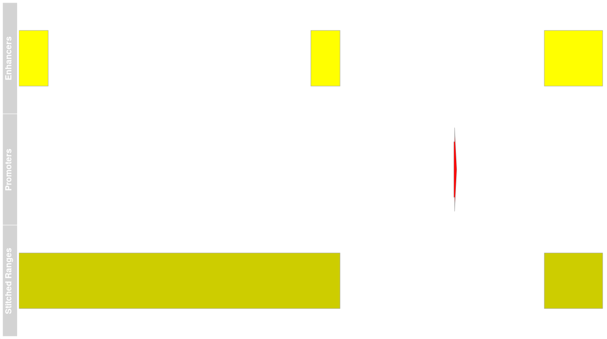

```{r setup, echo=FALSE}
knitr::opts_chunk$set(message = FALSE, warning = FALSE)
```

# Introduction

This package is designed to enable the Gene Regulatory Analysis using Variable 
IP ([GRAVI](https://github.com/steveped/GRAVI)) workflow, as a method for
detecting differential binding in ChIP-Seq datasets.
As a workflow focussed on data integration, most functions provided by the
package `extraChIPs` are designed to enable comparison across datasets.
This vignette looks primarily at functions which work with `GenomicRanges` 
objects.

# Installation

In order to use the package `extraChIPs` and follow this vignette, we recommend 
using the package `BiocManager` hosted on CRAN.
Once this is installed, the additional packages required for this vignette 
(`tidyverse`, `plyranges` and `Gviz`) can also be installed.

```{r install, eval = FALSE}
if (!"BiocManager" %in% rownames(installed.packages()))
  install.packages("BiocManager")
BiocManager::install(c("tidyverse", "plyranges", "Gviz"))
BiocManager::install("steveped/extraChIPs")
```


# Coercion

The advent of the `tidyverse` has led to `tibble` objects becoming a common
alternative to `data.frame` or `DataFrame` objects.
Simple functions within `extraChIP` enable coercion from `GRanges`, 
`GInteractions` and `DataFrame` objects to tibble objects, with list columns
correctly handled.
By default these coercion functions will coerce `GRanges` elements to a 
character vector.
Similarly, `GRanges` represented as a character column can be coerced to the 
ranges element of a `GRanges` object.

First let's coerce from a `tibble` (or S3 `data.frame`) to a `GRanges`

```{r gr}
library(tidyverse)
library(extraChIPs)
set.seed(73)
df <- tibble(
  range = c("chr1:1-10:+", "chr1:5-10:+", "chr1:5-6:+"),
  gene_id = "gene1",
  tx_id = paste0("transcript", 1:3),
  score = runif(3)
)
df
gr <- colToRanges(df, "range")
gr
```

Coercion back to a `tibble` will place the ranges as a character column by 
default.
However, this can be turned off and the conventional coercion from 
`as.data.frame` will instead be applied, internally wrapped in `as_tibble()`

```{r as-tibble}
as_tibble(gr)
as_tibble(gr, rangeAsChar = FALSE)
```

A simple feature which may be useful for printing gene names using `rmarkdown` 
is contained in `collapseGenes()`.
Here a character vector of gene names is collapsed into a `glue` object of 
length `, with gene names rendered in italics by default.

```{r collapse-gene, results='asis'}
gn <- c("Gene1", "Gene2", "Gene3")
collapseGenes(gn)
```


# Simple Operations Retaining `mcols()`

The standard set operations implemented in the package `GenomicRanges` will
always drop the `mcols` element by default.
The `extraChIPs` functions `reduceMC()`, `setdiffMC()`, `intersectMC()` and 
`unionMC()` all produce the same output as their similarly-named functions,
however, the `mcols()` elements in the query object are also returned.
Where required, columns are coerced into `CompressedList` columns.
This can particularly useful when needed to propagate the information contained 
in the initial ranges through to subsequent analytic steps

## Simplifying single `GRanges` objects

The classical approach to defining TSS regions for a set of transcripts would be
to use the function `resize`()`, setting the width as 1.

```{r tss}
tss <- resize(gr, width = 1)
tss
```

As we can see, two transcripts start at position 5, so we may choose to reduce 
this, which would lose the `mcols` element.
The alternative `reduceMC()` will retain all `mcols`.

```{r reduce}
GenomicRanges::reduce(tss)
reduceMC(tss)
```

By default, this function will attempt to coerce `mcols` to a new `mcol` of the 
appropriate type, however, when multiple values are inevitable such as for the 
`tx_id` column above, these will be coerced to a `CompressedList`.
The simplification of the multiple values seen in the `gene_id` can also be 
turned off if desired should repeated values be important for downstream 
analysis.

```{r reduce-no-simplify}
reduceMC(tss, simplify = FALSE) 
```

This allows for simple integration with `tidyverse` nesting strategies.

```{r reduce-unnest}
reduceMC(tss, simplify = FALSE) %>% 
  as_tibble() %>% 
  unnest(everything())
```

Whilst `reduceMC` relies on the range-reduction as implemented in 
`GenomicRanges::reduce()`, some alternative approaches are included, such as 
`chopMC()`, which finds identical ranges and nests the mcols element as 
`CompressedList` objects.

```{r chop}
chopMC(tss)
```

In the case of the object `tss`, this output is identical to `reduceMC()`, 
however, given that there are no identical ranges in `gr` the two functions 
would behave very differently on that object.

A final operation for simplifying `GRanges` objects would be `distinctMC()`
which finds unique ranges, along with unique `mcols`.
The columns to search can be called using `<tidy-select>` approaches,

```{r distinct}
distinctMC(tss)
distinctMC(tss, all_of("gene_id"))
```


## Set Operations with Two `GRanges` Objects

Whilst `reduce/reduceMC` is applied to a single `GRanges` object, the set 
operation functions `intersect`, `setdiff` and `union` are valuable approaches
for comparing ranges.
Using the `*MC()` functions will retain `mcols` elements from the *query range*.

```{r setopts}
peaks <- GRanges(c("chr1:1-5", "chr1:9-12:*"))
peaks$peak_id <- c("peak1", "peak2")
GenomicRanges::intersect(gr, peaks, ignore.strand = TRUE)
intersectMC(gr, peaks, ignore.strand = TRUE)
setdiffMC(gr, peaks, ignore.strand = TRUE)
unionMC(gr, peaks, ignore.strand = TRUE)
```

There is a performance overhead to preparation of mcols as `CompressedList` 
objects and all `mcols` in the query object will be returned.
If only wishing to retain a subset of `mcols`, these should be selected prior
to passing to these functions.

```{r setopts-plyranges}
library(plyranges)
gr %>% 
  select(tx_id) %>% 
  intersectMC(peaks, ignore.strand = TRUE)
```

## Overlapping proportions

Whilst the functions `findOverlaps()` and `overlapsAny()` are extremely 
useful, the addition of `propOverlap()` returns a numeric vector with
the proportion of each query range (`x`) which overlaps any range in the
subject range (`y`)

```{r prop-overlaps}
propOverlap(gr, peaks)
```

This is also extended to enable comparison across multiple features and to 
classify each peak by which features that it overlaps the most strongly.

```{r best-overlap}
bestOverlap(gr, peaks, var = "peak_id")
```


# More Complex Operations 

## Range Paritioning

In addition to standard set operations, one set of ranges can be used to 
partition another set of ranges, returning `mcols` from both ranges.
Ranges from the query range (`x`) are returned after being partitioned by the
ranges in the subject range (`y`).
Subject ranges used for partitioning *must be non-overlapping*, and if 
overlapping ranges are provided, these will be reduced prior to partitioning.

This enables the identification of specific ranges from the query range (`x`) 
which overlap ranges from the subject range (`y`)
Under this approach, `mcols` from both `query` and `subject` ranges will be
returned to enable the clear ranges which are common and distinct within the
two sets of ranges.

```{r partition-ranges}
partitionRanges(gr, peaks)
```

Whilst this shares some similarity with `intersectMC()` the additional 
capabilities provide greater flexibility.

```{r partition-ranges-subset}
partitionRanges(gr, peaks) %>% 
  subset(is.na(peak_id))
```

## Stitching Ranges

Using the function `stitchRanges()` we are able to join together sets of nearby 
ranges, but with the option of placing clear barriers between ranges, across
which ranges cannot be joined.
This may be useful if joining enhancers to form putative super-enhancers, but
explicitly omitting defined promoter regions.

```{r stitch-ranges}
enh <- GRanges(c("chr1:1-10", "chr1:101-110", "chr1:181-200"))
prom <- GRanges("chr1:150:+")
se <- stitchRanges(enh, exclude = prom, maxgap = 100)
se
```

As a visualisation (below) ranges within 100bp were stitched together, however
the region defined as a 'promoter' acted as a barrier and ranges were not 
stitched together across this barrier.

```{r plot-stitched, echo = FALSE, fig.height=3, fig.width=8}

```

